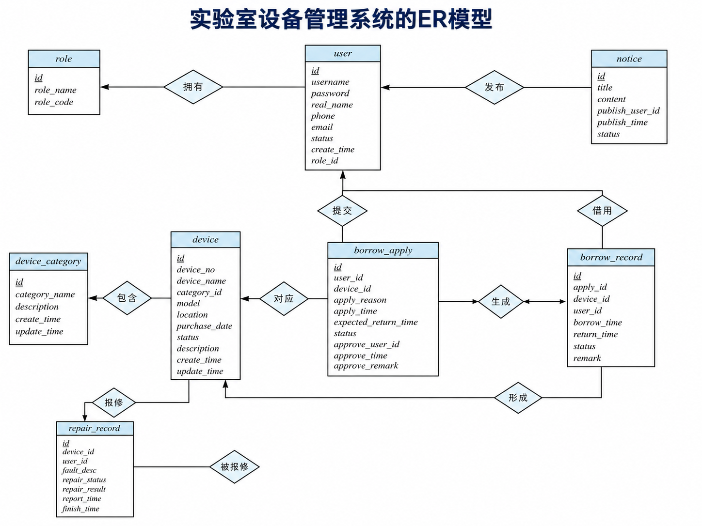

# 校园实验室设备管理系统

## 项目简介
本系统为校园实验室设备管理系统，针对高校实验室传统纸质登记、人工管理效率低、设备追踪困难、报修流程混乱等问题开发。依托 Spring Boot+MySQL 技术栈，区分学生、实验员、管理员三类角色，实现设备管理、借用审批、借还登记、故障报修、公告发布与数据统计全流程线上化，规范实验室设备日常管理，提升资源利用效率。

## 团队成员与分工

本项目由以下成员协作开发完成：

| 姓名 | Git 账号 | 负责角色 | 核心工作内容                            |
| :--- | :--- | :--- |:----------------------------------|
| **肖贤宇** | xianyu-XTU | 项目负责人/数据库设计 | 负责数据库设计、SQL 编写、设备管理与分类功能开发，支撑全系统数据层 |
| **刘奕辰** | xtulyc | 后端设计 |	搭建 Spring Boot 框架，实现登录注册、权限拦截，负责接口联调与功能整合 |
| **陆  毅** | luyi1314 | 前端设计 | 负责设备借用、审批、归还全流程页面与接口开发，实现业务流程闭环 |
| **陈鹏辉** | kongningjing | 需求分析与汇总 | 负责报修流程、维修处理、公告管理与数据统计模块的开发与实现 |
| **李  昊** | JFms-20 | 测试与文档撰写 | 负责项目文档整理、页面统一布局、功能测试用例编写与成果汇总 |

## 数据库ER模型

# 校园实验室设备管理系统后端

## 技术栈

- Spring Boot 3
- MyBatis-Plus
- MySQL
- Lombok
- Maven

## 运行步骤

1. 先在 MySQL 中执行仓库根目录下的 `database/lab_equipment.sql`
2. 修改 `src/main/resources/application.yml` 中的数据库用户名和密码
3. 在当前 `backend` 目录运行：

```bash
mvn spring-boot:run
```

## 测试账号

- 管理员：admin / 123456
- 实验员：lab / 123456
- 学生：student / 123456

## 常用接口

登录：

```http
POST /api/auth/login
Content-Type: application/json

{
  "username":"admin",
  "password":"123456"
}
```

登录成功后，把返回的 token 放到请求头：

```http
Authorization: Bearer 你的token
```

设备列表：

```http
GET /api/devices?page=1&size=10
```

借用申请：

```http
POST /api/borrow/apply
Authorization: Bearer 学生token
Content-Type: application/json

{
  "deviceId":1,
  "applyReason":"课程实验使用",
  "expectedReturnTime":"2026-05-20T18:00:00"
}
```

审批申请：

```http
POST /api/borrow/approve
Authorization: Bearer 实验员或管理员token
Content-Type: application/json

{
  "applyId":1,
  "status":1,
  "approveRemark":"同意借用"
}
```

归还设备：

```http
POST /api/borrow/return
Authorization: Bearer 实验员或管理员token
Content-Type: application/json

{
  "recordId":1,
  "remark":"设备完好归还"
}
```

报修：

```http
POST /api/repairs/report
Authorization: Bearer 用户token
Content-Type: application/json

{
  "deviceId":1,
  "faultDesc":"无法正常开机"
}
```

统计：

```http
GET /api/stats/overview
```
