# 软件说明书（中期 / 结项共用主文档）

## 基本信息

**项目名称：** 校园实验室设备管理系统  
**学    院：** 创业学院  
**小组序号：** 36  
**成员姓名：** 肖贤宇 / 刘奕辰 / 陆毅 / 陈鹏辉 / 李昊  
**指导老师：** 尹兆远  
**当前版本：** 结项版  
**更新日期：** 2026年5月18日  
**源代码仓库：** https://github.com/xianyu-XTU/lab-equipment-management-system  

---

## 一、项目概述

### 1. 项目背景

随着高校实验教学活动日益丰富，实验室设备种类和使用频率不断增加。传统实验室设备管理方式主要依赖纸质登记、Excel 表格或口头沟通，存在信息不集中、设备去向不清、审批流程不规范、归还不及时、损坏责任难追踪、维修记录不完整等问题。

为提高实验室设备资源利用率和管理规范性，本项目开发了面向学生、实验员和管理员的校园实验室设备管理系统。系统围绕设备信息维护、设备借用申请、借用审批、借出归还、设备报修、维修处理、公告发布和数据统计等核心业务，实现实验室设备管理流程线上化、信息化和可追溯化。

### 2. 项目目标

本项目最终目标是构建一个功能完整、界面清晰、流程闭环、可运行演示的实验室设备管理系统，具体目标如下：

- 建立统一的实验室设备信息管理平台，实现设备基础信息集中维护。
- 实现设备借用申请、审批、借出和归还流程线上化。
- 实现设备状态动态更新，支持正常、待审批、借用中、维修中等状态管理。
- 实现设备报修申请、维修处理和维修记录管理。
- 支持管理员发布系统公告，方便通知实验室相关事项。
- 支持多角色登录与权限控制，区分学生、实验员和管理员操作范围。
- 实现基础统计分析功能，辅助管理员了解设备使用和维修情况。
- 完成系统部署、功能测试、文档整理和项目结项材料归档。

### 3. 开发环境与条件

| 类别 | 内容 |
|---|---|
| 开发工具 | IntelliJ IDEA、VS Code、Navicat、Git |
| 前端技术 | HTML、CSS、Bootstrap、JavaScript、Ajax / axios |
| 后端技术 | Spring Boot 3、Spring MVC、MyBatis-Plus、Lombok |
| 数据库 | MySQL 8.0 |
| 构建工具 | Maven |
| 运行环境 | Windows 10 / Windows 11，JDK 17 及以上 |
| 版本管理 | GitHub |
| 浏览器 | Chrome、Edge、Firefox 等主流浏览器 |

---

## 二、需求分析

### 1. 功能需求

系统面向三类核心用户：学生、实验员和管理员。不同角色登录后进入不同页面，并只能访问其权限范围内的功能。

#### （1）学生端需求

学生用户主要完成设备查看、借用申请、个人借用记录查询和设备报修等操作：

- 登录系统并进入学生端面板。
- 查看设备列表、设备状态和设备分类。
- 对可借设备提交借用申请。
- 查看个人借用申请审批状态。
- 查看个人借用记录和归还状态。
- 对自己正在借用的设备提交报修申请。
- 查看个人报修记录及处理进度。
- 查看系统公告和实验室通知。

#### （2）实验员端需求

实验员用户主要负责设备日常管理、借用审批、归还登记和报修处理：

- 登录系统并进入实验员端面板。
- 查看设备列表、设备分类和设备当前状态。
- 新增或修改设备信息。
- 查看学生提交的借用申请。
- 审批借用申请。
- 查看借用记录并登记设备归还。
- 查看报修记录并处理维修状态。
- 查看系统公告和基础统计信息。

#### （3）管理员端需求

管理员用户负责系统整体维护、用户管理、设备管理和数据统计：

- 登录系统并进入管理员端面板。
- 查看、新增、修改用户信息，调整用户状态。
- 管理设备分类和设备基础信息。
- 新增、修改、删除设备信息。
- 查看并审批借用申请。
- 查看借用记录、报修记录和维修状态。
- 发布系统公告。
- 查看系统统计概览。

#### （1）登录与权限流程

用户在登录页输入账号和密码后，前端调用后端登录接口。登录成功后，后端返回 token 和用户基本信息，前端将 token 与用户信息保存到 LocalStorage。后续请求统一携带 `Authorization: Bearer <token>` 请求头。前端根据用户角色跳转到不同页面：管理员进入 `board_admin.html`，实验员进入 `board_lab.html`，学生进入 `board_student.html`。

```text
用户输入账号密码
      │
      ▼
调用 /api/auth/login
      │
      ▼
后端校验账号、密码和用户状态
      │
      ▼
返回 token、userId、username、realName、roleCode
      │
      ▼
前端保存登录信息并按角色跳转页面
```

#### （2）设备借用流程

学生登录后查看设备列表，选择可借设备并提交借用申请。管理员或实验员审批申请。审批通过后，系统生成借用记录并将设备状态改为已借出；审批拒绝则记录审批结果，流程结束。设备使用完成后，由实验员或管理员登记归还，系统更新借用记录并将设备状态恢复为可借。

```text
学生登录
   │
   ▼
查看可借设备
   │
   ▼
提交借用申请
   │
   ▼
管理员 / 实验员审批
   │
   ├── 拒绝：记录审批结果，流程结束
   │
   └── 通过：生成借用记录，设备状态改为已借出
                 │
                 ▼
              设备使用
                 │
                 ▼
          实验员 / 管理员登记归还
                 │
                 ▼
          更新借用记录和设备状态
```

#### （3）设备报修流程

用户发现设备异常后可提交报修申请。系统记录设备、报修人和故障描述，并将设备状态改为维修中。实验员或管理员查看报修记录后进行处理，可将报修状态更新为维修中或已完成。维修完成后，系统根据设备是否仍存在借用中记录，将设备状态恢复为已借出或可借。

```text
发现设备故障
   │
   ▼
提交报修申请
   │
   ▼
系统记录故障并更新设备状态为维修中
   │
   ▼
实验员 / 管理员处理报修
   │
   ▼
填写处理说明并更新维修状态
   │
   ▼
维修完成后恢复设备状态
```

### 3. 非功能需求

| 类型 | 需求说明 |
|---|---|
| 性能要求 | 常用查询、提交、审批、归还等操作响应及时，支持分页查询。 |
| 安全要求 | 登录校验、Token 鉴权、角色权限隔离、接口访问控制和基础输入校验。 |
| 可用性要求 | 页面功能明确，学生端、实验员端和管理员端分工清晰。 |
| 可维护性要求 | 后端采用 Controller、Service、Mapper、Entity、DTO 分层结构，便于维护。 |
| 兼容性要求 | 前端为静态 HTML 页面，可在主流浏览器中访问。 |
| 数据一致性 | 借用、审批、归还、报修等涉及设备状态变化的操作需要保证业务数据同步。 |

---

## 三、系统设计

### 1. 系统架构设计

系统采用前后端分离思想。前端由静态 HTML 页面和 JavaScript 组成，负责页面展示、表单交互和接口请求；后端基于 Spring Boot 构建，负责认证、权限校验、业务逻辑处理和数据返回；数据库使用 MySQL 保存角色、用户、设备、分类、借用申请、借用记录、报修记录和公告数据。

```text
用户浏览器
   │
   │  HTML 页面 / JavaScript 交互
   ▼
前端 frontend
   │
   │  HTTP JSON 请求，携带 Bearer Token
   ▼
后端 backend：Spring Boot
   │
   ├── Controller：接收请求，返回统一结果
   ├── Service：处理认证、借用、审批、归还、报修等业务
   ├── Mapper：通过 MyBatis-Plus 访问数据库
   └── Entity / DTO：封装数据表实体和请求响应对象
   │
   ▼
MySQL 数据库 lab_equipment
```

### 2. 模块设计

系统主要包括用户与权限管理、设备信息管理、借用申请与审批、报修与维修管理和公告管理五个核心模块。各模块之间通过用户身份、设备状态和业务记录相互关联，共同构成完整的实验室设备管理流程。

#### （1）用户与权限管理模块

该模块负责用户注册登录、角色区分、个人信息维护和密码修改。系统通过用户角色字段区分学生、实验员和管理员，不同角色登录后进入对应功能页面，并只能访问其权限范围内的接口。


#### （2）设备信息管理模块

该模块负责设备录入、分类管理、设备状态管理和设备查询筛选。管理员可维护设备基础信息和分类信息，实验员可根据设备使用、维修和归还情况更新设备状态。

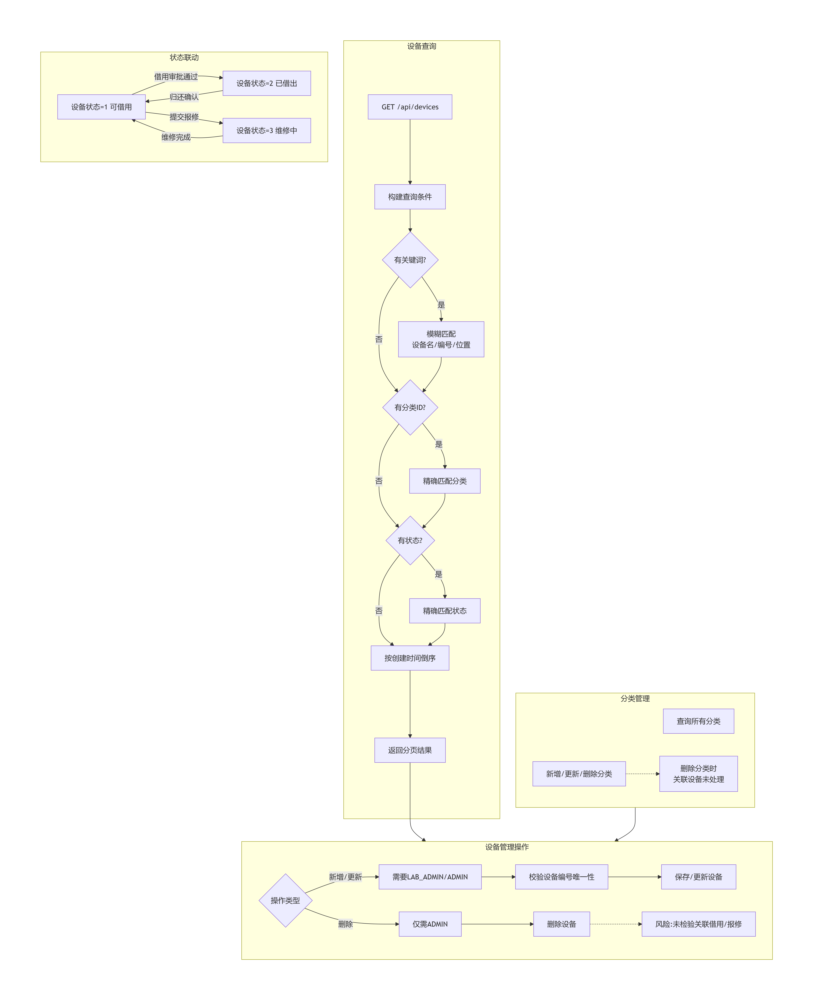

#### （3）借用申请与审批模块

该模块负责设备借用申请、审批、借出登记、归还登记和借用历史查询。学生提交申请后，管理员或实验员进行审批；审批通过后登记借出，归还时更新设备状态并保存借还记录。

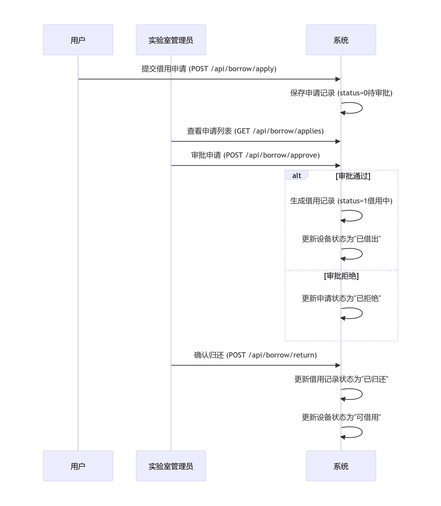

#### （4）报修与维修管理模块

该模块负责设备报修申请、维修状态更新、维修说明填写和维修历史查询。用户提交报修后，实验员或管理员处理维修任务，维修完成后更新设备状态。

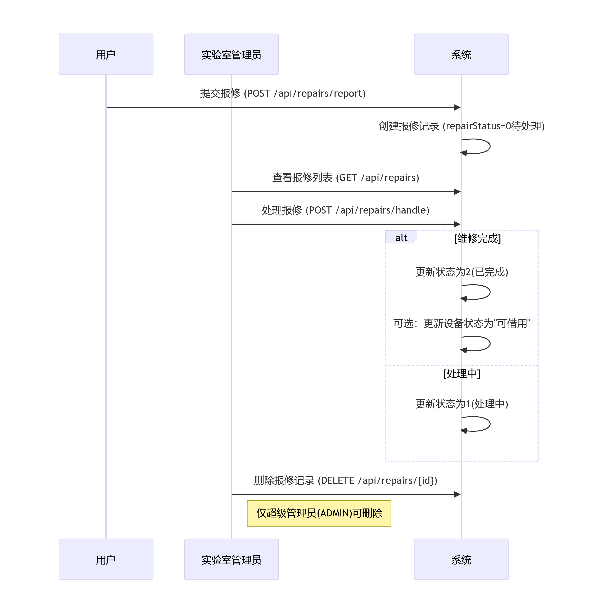

#### （5）公告管理模块

该模块负责公告发布、修改、删除和查看。管理员可发布实验室通知、系统使用说明、设备维护提醒等公告，学生和实验员登录后可查看公告内容。


### 3. 前端设计

前端位于 `frontend` 目录，采用 HTML、CSS 和原生 JavaScript 实现，主要页面如下：

| 文件 | 说明 |
|---|---|
| `login.html` | 登录页面 |
| `sign up and sign in v2.html` | 注册 / 登录相关页面 |
| `board_student.html` | 学生端面板 |
| `board_lab.html` | 实验员端面板 |
| `board_admin.html` | 管理员端面板 |
| `profile.html` | 个人信息页面 |
| `js/api.js` | 前端统一接口封装 |
| `js/auth.js` | 认证兼容脚本 |

前端统一通过 `frontend/js/api.js` 请求后端。`api.js` 中配置后端基础地址为 `http://localhost:8080`，并封装登录、注册、设备、分类、借用、报修、公告、用户和统计相关接口。登录成功后，前端将 token 和用户信息保存到 LocalStorage，并在后续请求中自动添加认证请求头。

角色跳转规则如下：

| 角色编码 | 页面 |
|---|---|
| `ADMIN` | `board_admin.html` |
| `LAB_ADMIN` | `board_lab.html` |
| `STUDENT` | `board_student.html` |

### 4. 后端设计

后端位于 `backend` 目录，采用 Spring Boot 3 + MyBatis-Plus 实现，主要包结构如下：

| 包名 | 说明 |
|---|---|
| `annotation` | 自定义权限注解 |
| `common` | 统一返回结果、认证上下文等公共类 |
| `config` | Web 配置、拦截器、分页插件等配置 |
| `controller` | REST 接口控制层 |
| `dto` | 请求和响应数据传输对象 |
| `entity` | 数据库实体类 |
| `mapper` | MyBatis-Plus 数据访问层 |
| `service` | 业务逻辑层 |

主要接口设计如下：

| 模块 | 接口 | 说明 |
|---|---|---|
| 认证 | `POST /api/auth/login` | 用户登录 |
| 认证 | `POST /api/auth/register` | 用户注册 |
| 设备 | `GET /api/devices` | 分页查询设备 |
| 设备 | `POST /api/devices` | 新增设备 |
| 设备 | `PUT /api/devices` | 修改设备 |
| 设备 | `DELETE /api/devices/{id}` | 删除设备 |
| 分类 | `GET /api/categories` | 查询分类 |
| 分类 | `POST /api/categories` | 新增分类 |
| 借用 | `POST /api/borrow/apply` | 提交借用申请 |
| 借用 | `GET /api/borrow/applies` | 查询借用申请 |
| 借用 | `POST /api/borrow/approve` | 审批借用申请 |
| 借用 | `GET /api/borrow/records` | 查询借用记录 |
| 借用 | `POST /api/borrow/return` | 登记归还 |
| 报修 | `POST /api/repairs/report` | 提交报修 |
| 报修 | `GET /api/repairs` | 查询报修记录 |
| 报修 | `POST /api/repairs/handle` | 处理报修 |
| 公告 | `GET /api/notices` | 分页查询公告 |
| 公告 | `POST /api/notices` | 管理员发布公告 |
| 用户 | `GET /api/users` | 管理员分页查询用户 |
| 用户 | `PUT /api/users` | 管理员修改用户信息 |
| 用户 | `PUT /api/users/{id}/status` | 管理员修改用户状态 |
| 统计 | `GET /api/stats/overview` | 管理员 / 实验员查看统计概览 |

### 5. 数据库设计

数据库位于 `database` 目录，当前主要脚本包括：

| 文件 | 说明 |
|---|---|
| `lab_equipment_create.sql` | 创建数据库、表结构和基础测试数据 |
| `lab_equipment_data.sql` | 扩展测试数据 |
| `datas/` | 数据相关材料 |
| `migrations/` | 数据迁移相关材料 |

当前系统实际核心表如下：

| 数据表 | 说明 |
|---|---|
| `role` | 角色表，保存管理员、实验员、学生等角色 |
| `user` | 用户表，保存账号、密码、姓名、角色、状态等信息 |
| `device_category` | 设备分类表 |
| `device` | 设备表，保存设备编号、名称、分类、型号、位置、状态等信息 |
| `borrow_apply` | 借用申请表，保存学生申请、审批状态和审批信息 |
| `borrow_record` | 借用记录表，保存实际借出和归还记录 |
| `repair_record` | 报修记录表，保存故障描述、处理状态和维修说明 |
| `notice` | 公告表，保存公告标题、内容、发布人、发布时间和状态 |


主要状态编码如下：

| 字段 | 编码 | 含义 |
|---|---|---|
| `device.status` | 1 | 可借 |
| `device.status` | 2 | 已借出 |
| `device.status` | 3 | 维修中 |
| `device.status` | 4 | 停用 / 报废 |
| `borrow_apply.status` | 0 | 待审批 |
| `borrow_apply.status` | 1 | 已通过 |
| `borrow_apply.status` | 2 | 已拒绝 |
| `borrow_record.status` | 1 | 借用中 |
| `borrow_record.status` | 2 | 已归还 |
| `borrow_record.status` | 3 | 逾期未归还 |
| `repair_record.status` | 0 | 待处理 |
| `repair_record.status` | 1 | 维修中 |
| `repair_record.status` | 2 | 已完成 |

---

## 四、系统实现  

### 1. 关键技术

本系统采用前后端分离的设计思想，前端负责页面展示和用户交互，后端负责业务处理、权限校验和数据访问，数据库负责保存用户、设备、借用、报修和公告等业务数据。系统在结项阶段已完成主要功能开发，核心技术和实现要点如下。

#### （1）Spring Boot 后端框架

后端基于 Spring Boot 3 搭建，使用 Spring MVC 提供 RESTful 接口。系统按照 Controller、Service、Mapper、Entity、DTO 等层次组织代码，降低各模块之间的耦合度，便于后期维护和扩展。

Controller 层负责接收前端请求并返回统一结果；Service 层负责实现登录、借用、审批、归还、报修等核心业务逻辑；Mapper 层基于 MyBatis-Plus 完成数据库访问；Entity 和 DTO 分别用于映射数据库表和封装接口请求、响应数据。

#### （2）MyBatis-Plus 数据访问技术

系统使用 MyBatis-Plus 简化数据库增删改查操作。对于用户、设备、分类、借用申请、借用记录、报修记录和公告等表，均建立了对应实体类和 Mapper 接口。

MyBatis-Plus 提供的通用 Mapper 方法减少了重复 SQL 编写工作，同时系统使用分页查询支持设备列表、用户列表、借用记录、报修记录和公告列表展示，提高了后台接口的可维护性和查询效率。

#### （3）MySQL 数据库存储

系统数据库名称为 `lab_equipment`，核心表包括：

```text
role
user
device_category
device
borrow_apply
borrow_record
repair_record
notice
```

其中，`borrow_apply` 用于保存设备借用申请，`borrow_record` 用于保存实际借用记录。这样可以清楚地区分“申请审批阶段”和“实际借出阶段”。`repair_record` 用于保存设备报修和维修处理信息，方便后续查询和统计。

#### （4）Token 登录认证与角色权限控制

系统登录成功后，后端返回 token、用户 ID、用户名、真实姓名和角色编码。前端将 token 与用户信息保存到 LocalStorage，后续请求统一在请求头中携带：

```text
Authorization: Bearer <token>
```

后端通过拦截器解析 token 并保存当前登录用户信息。对于需要权限限制的接口，系统使用自定义 `@RequireRole` 注解进行控制。例如：用户管理接口仅管理员可访问；借用审批、归还和报修处理接口允许管理员和实验员访问；学生只能提交借用申请和查看自己的相关记录。

#### （5）前端统一 API 封装

前端使用 HTML、CSS 和 JavaScript 实现。所有后端请求统一封装在 `frontend/js/api.js` 中，便于集中管理接口地址、请求头、token 携带、异常处理和角色跳转逻辑。

当前前端根据登录返回的角色编码进行页面跳转：

| 角色编码 | 页面 |
|---|---|
| `ADMIN` | `board_admin.html` |
| `LAB_ADMIN` | `board_lab.html` |
| `STUDENT` | `board_student.html` |

这种方式使三个角色的页面职责更加清晰，也便于在前端进行功能区分。

#### （6）设备状态联动处理

设备状态是系统业务的核心之一。系统通过状态字段表示设备当前情况：

| 状态值 | 含义 |
|---|---|
| 1 | 可借 |
| 2 | 已借出 |
| 3 | 维修中 |
| 4 | 停用 / 报废 |

当学生提交借用申请时，系统会检查设备是否处于可借状态；当申请审批通过后，系统生成借用记录并将设备状态修改为已借出；当设备归还后，设备状态恢复为可借；当设备报修后，设备状态修改为维修中；维修完成后，系统根据设备是否仍存在借用中记录决定恢复为已借出或可借。

#### （7）统一返回结果与异常提示

系统后端使用统一返回结果类 `Result` 封装接口响应，返回内容一般包括状态码、提示信息和数据内容。前端收到响应后可统一判断请求是否成功，并给用户显示对应提示。

统一返回结构提高了前后端接口的一致性，也减少了前端对不同接口返回格式的适配工作。

---

### 2. 界面展示

系统在结项阶段已完成学生端、实验员端和管理员端主要页面。由于系统采用多角色登录，不同角色登录后会进入不同功能面板。

#### （1）登录界面

登录界面用于用户输入账号和密码。系统根据账号信息判断用户身份，登录成功后返回 token 和角色信息，并自动跳转到对应角色页面。

> 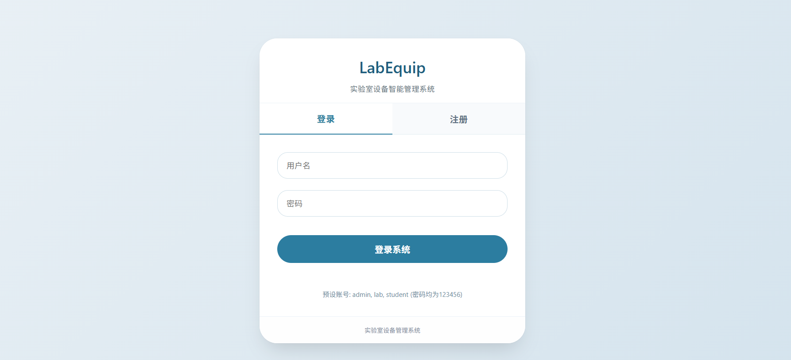
> 图片说明：用户在该页面输入用户名和密码，系统验证通过后根据角色跳转到管理员端、实验员端或学生端。

#### （2）学生端界面

学生端主要面向普通学生用户，功能包括查看设备列表、提交借用申请、查看个人借用记录、提交报修申请、查看报修进度和查看系统公告。

> 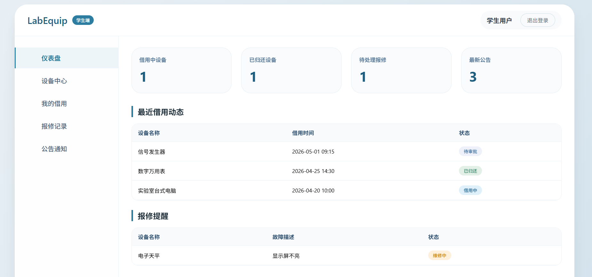
> 图片说明：学生登录后可以查看可借设备，并对需要使用的设备提交借用申请；借用期间如设备故障，可提交报修。

#### （3）实验员端界面

实验员端主要用于实验室日常管理，功能包括查看设备、审批学生借用申请、登记设备归还、处理设备报修和查看统计数据。

> 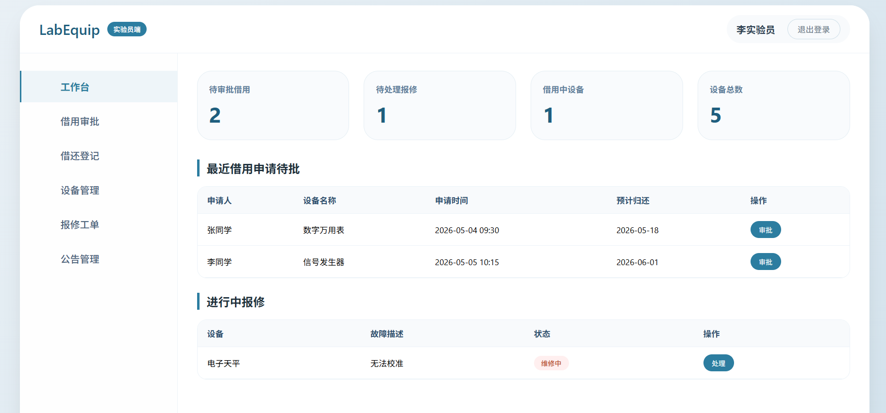
> 图片说明：实验员可以处理学生提交的借用申请和报修申请，并维护设备实际使用状态。

#### （4）管理员端界面

管理员端是系统最高权限页面，功能包括用户管理、设备管理、分类管理、借用审批、报修管理、公告发布和统计概览。

> 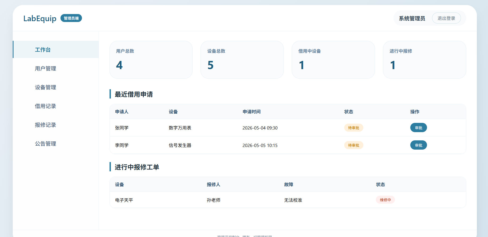
> 图片说明：管理员可以对系统基础数据进行维护，并查看设备、借用和报修等统计信息。

#### （5）设备管理界面

设备管理界面用于展示设备列表，支持查看设备名称、分类、型号、位置和状态。管理员或实验员可以新增或修改设备信息，管理员还可以删除设备。

> 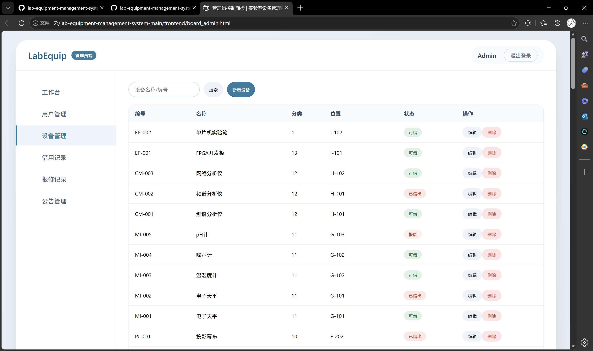
> 图片说明：设备管理页面集中展示设备基础信息和当前状态，是系统业务运行的基础。

#### （6）借用审批界面

借用审批界面用于展示学生提交的设备借用申请。管理员或实验员可以查看申请人、设备信息、申请时间和申请原因，并选择通过或拒绝。

> 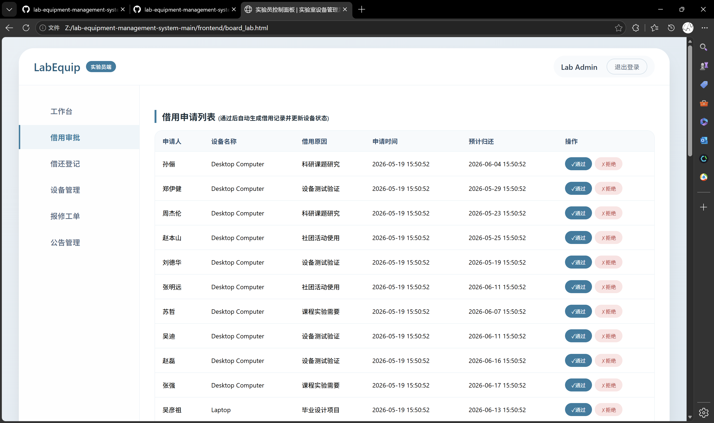
> 图片说明：审批通过后，系统会自动生成借用记录，并将设备状态修改为已借出。

#### （7）报修处理界面

报修处理界面用于展示设备故障信息和维修状态。管理员或实验员可以填写处理说明，并将维修状态更新为维修中或已完成。

> 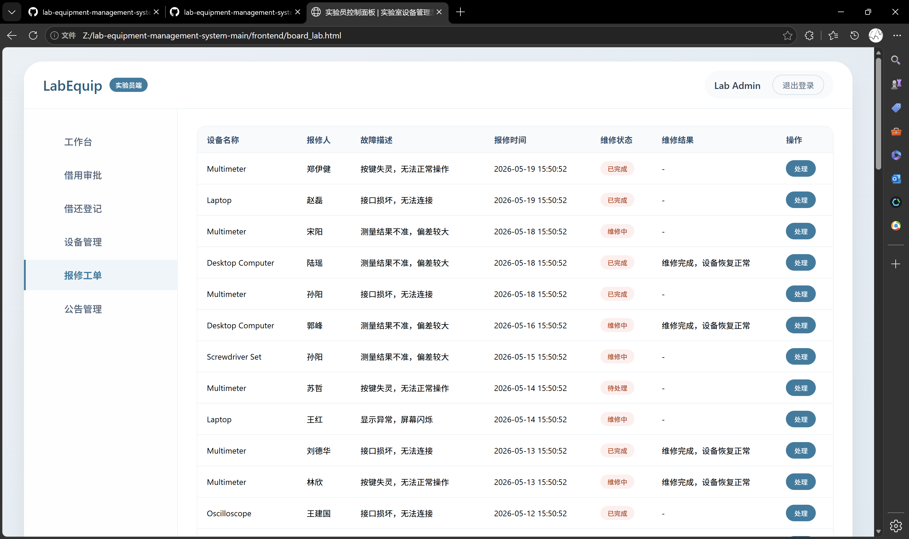
> 图片说明：报修处理完成后，系统会根据设备借用情况自动恢复设备状态。

---

### 3. 核心代码片段

本节展示系统中具有代表性的关键代码，包括前端请求封装、登录接口、权限注解、设备借用审批和报修处理等内容。

#### （1）前端统一请求封装

前端在 `frontend/js/api.js` 中封装统一请求方法。该方法会自动读取本地保存的 token，并放入请求头中。如果后端返回 401，说明登录失效，前端会清除本地登录信息并跳转到登录页面。

```javascript
const API_BASE = "http://localhost:8080";

async function request(path, options = {}) {
  const token = localStorage.getItem("token");
  const headers = {
    "Content-Type": "application/json",
    ...(options.headers || {})
  };

  if (token) {
    headers["Authorization"] = "Bearer " + token;
  }

  const res = await fetch(API_BASE + path, {
    ...options,
    headers
  });

  const json = await res.json();

  if (res.status === 401) {
    localStorage.removeItem("token");
    localStorage.removeItem("loginUser");
    window.location.href = "login.html";
  }

  return json;
}
```

该代码实现了前端接口请求的统一入口，避免每个页面重复编写 token 携带和异常处理逻辑。

#### （2）用户登录接口

后端登录接口位于认证控制器中，前端提交账号和密码后，后端调用业务层完成账号校验和登录信息生成。

```java
@RestController
@RequestMapping("/api/auth")
public class AuthController {

    private final AuthService authService;

    public AuthController(AuthService authService) {
        this.authService = authService;
    }

    @PostMapping("/login")
    public Result<LoginResponse> login(@RequestBody LoginRequest request) {
        return Result.ok(authService.login(request));
    }

    @PostMapping("/register")
    public Result<Void> register(@RequestBody RegisterRequest request) {
        authService.register(request);
        return Result.ok();
    }
}
```

登录成功后，系统返回 token、用户 ID、用户名、真实姓名和角色编码，前端根据角色编码跳转到对应页面。

#### （3）角色权限注解

系统使用自定义 `@RequireRole` 注解标记需要特定角色才能访问的接口。该注解可作用在类或方法上，用于声明允许访问的角色列表。

```java
@Target({ElementType.METHOD, ElementType.TYPE})
@Retention(RetentionPolicy.RUNTIME)
public @interface RequireRole {
    String[] value();
}
```

例如，用户管理接口只允许管理员访问：

```java
@RestController
@RequestMapping("/api/users")
@RequireRole({"ADMIN"})
public class UserController {
    // 用户管理相关接口
}
```

借用审批和归还接口允许管理员和实验员访问：

```java
@RequireRole({"LAB_ADMIN", "ADMIN"})
@PostMapping("/approve")
public Result<Void> approve(@RequestBody BorrowApproveRequest request) {
    borrowService.approve(request);
    return Result.ok();
}
```

通过这种方式，系统实现了接口级权限控制，避免普通学生访问管理功能。

#### （4）设备借用审批核心逻辑

借用审批是系统的核心业务之一。审批通过时，系统需要修改申请状态、生成借用记录，并同步更新设备状态为已借出；审批拒绝时，只记录审批结果。

```java
@Transactional
public void approve(BorrowApproveRequest request) {
    BorrowApply apply = borrowApplyMapper.selectById(request.getApplyId());
    if (apply == null) {
        throw new RuntimeException("借用申请不存在");
    }
    if (!Objects.equals(apply.getStatus(), 0)) {
        throw new RuntimeException("该申请已处理");
    }

    Device device = deviceMapper.selectById(apply.getDeviceId());
    if (device == null) {
        throw new RuntimeException("设备不存在");
    }

    apply.setStatus(request.getApproved() ? 1 : 2);
    apply.setApproveRemark(request.getRemark());
    apply.setApproveTime(LocalDateTime.now());
    apply.setApproverId(AuthContext.getUserId());
    borrowApplyMapper.updateById(apply);

    if (request.getApproved()) {
        if (!Objects.equals(device.getStatus(), 1)) {
            throw new RuntimeException("设备当前不可借");
        }

        BorrowRecord record = new BorrowRecord();
        record.setApplyId(apply.getId());
        record.setUserId(apply.getUserId());
        record.setDeviceId(apply.getDeviceId());
        record.setBorrowTime(LocalDateTime.now());
        record.setStatus(1);
        borrowRecordMapper.insert(record);

        device.setStatus(2);
        deviceMapper.updateById(device);
    }
}
```

该方法使用事务控制，保证借用申请、借用记录和设备状态三部分数据同时成功或同时回滚，避免出现审批成功但设备状态未更新的问题。

#### （5）设备归还核心逻辑

设备归还是借用流程的结束环节。归还时，系统需要更新借用记录状态和归还时间，并将设备状态恢复为可借。

```java
@Transactional
public void returnDevice(Long recordId) {
    BorrowRecord record = borrowRecordMapper.selectById(recordId);
    if (record == null) {
        throw new RuntimeException("借用记录不存在");
    }
    if (!Objects.equals(record.getStatus(), 1)) {
        throw new RuntimeException("该记录不是借用中状态");
    }

    record.setReturnTime(LocalDateTime.now());
    record.setStatus(2);
    borrowRecordMapper.updateById(record);

    Device device = deviceMapper.selectById(record.getDeviceId());
    if (device != null && Objects.equals(device.getStatus(), 2)) {
        device.setStatus(1);
        deviceMapper.updateById(device);
    }
}
```

该代码保证设备归还后，借用记录和设备状态保持一致。

#### （6）设备报修核心逻辑

报修功能用于处理设备故障。学生报修时，系统会校验设备是否存在，并限制学生只能报修自己正在借用的设备。报修提交后，设备状态会被改为维修中。

```java
@Transactional
public void report(RepairReportRequest request) {
    Device device = deviceMapper.selectById(request.getDeviceId());
    if (device == null) {
        throw new RuntimeException("设备不存在");
    }
    if (Objects.equals(device.getStatus(), 4)) {
        throw new RuntimeException("停用设备不能报修");
    }

    if ("STUDENT".equals(AuthContext.getRoleCode())) {
        LambdaQueryWrapper<BorrowRecord> wrapper = new LambdaQueryWrapper<>();
        wrapper.eq(BorrowRecord::getUserId, AuthContext.getUserId())
               .eq(BorrowRecord::getDeviceId, request.getDeviceId())
               .eq(BorrowRecord::getStatus, 1);

        Long count = borrowRecordMapper.selectCount(wrapper);
        if (count == null || count == 0) {
            throw new RuntimeException("学生只能报修自己正在借用的设备");
        }
    }

    RepairRecord record = new RepairRecord();
    record.setDeviceId(request.getDeviceId());
    record.setUserId(AuthContext.getUserId());
    record.setDescription(request.getDescription());
    record.setStatus(0);
    record.setCreateTime(LocalDateTime.now());
    repairRecordMapper.insert(record);

    device.setStatus(3);
    deviceMapper.updateById(device);
}
```

该代码体现了系统对设备报修权限和设备状态联动的控制，避免学生随意报修未借用设备。

#### （7）统计概览接口

统计概览接口用于统计设备、借用和报修相关数据，帮助管理员和实验员快速了解系统当前运行情况。

```java
@RestController
@RequestMapping("/api/stats")
public class StatsController {

    private final StatsService statsService;

    public StatsController(StatsService statsService) {
        this.statsService = statsService;
    }

    @RequireRole({"ADMIN", "LAB_ADMIN"})
    @GetMapping("/overview")
    public Result<StatsOverviewResponse> overview() {
        return Result.ok(statsService.overview());
    }
}
```

该接口只允许管理员和实验员访问，学生用户不能查看系统整体统计数据。

> 结项说明：  
> 本章已补全最终关键技术说明，并根据当前系统实现整理了登录认证、权限控制、借用审批、设备归还、设备报修和统计概览等核心代码片段。

---

## 五、系统测试

### 1. 测试方案

系统测试围绕校园实验室设备管理系统的核心业务流程展开，采用手工功能测试为主，接口测试、数据库验证和前端交互测试为辅的方式进行。测试目标是验证系统在学生、实验员、管理员三类角色下是否能够正常完成登录、设备管理、借用申请、借用审批、设备归还、设备报修、公告查看、公告发布和统计展示等功能。

本次测试主要参考项目中的系统测试资料，包括：

```text
系统测试
├── 测试计划.md
├── 测试用例.md
├── 测试结果.docx
├── 前端bug记录以及修复bug记录.md
├── 后端bug记录以及修复bug记录.md
└── 数据库bug记录以及修复bug记录.md
```

测试重点如下：

- 登录与权限测试：验证管理员、实验员、学生账号能否正常登录，以及不同角色是否进入对应页面。
- 设备管理测试：验证设备列表展示、新增设备、修改设备、删除设备、设备状态显示等功能。
- 设备分类测试：验证设备分类查询和新增功能。
- 借用流程测试：验证学生提交借用申请、管理员或实验员审批、生成借用记录和登记归还等流程。
- 报修维修测试：验证学生提交报修、管理员或实验员处理报修，以及设备状态联动是否正确。
- 公告管理测试：验证公告发布和公告查看功能。
- 统计分析测试：验证管理员和实验员是否可以正常查看统计概览数据。
- 异常场景测试：验证错误密码、未登录访问、越权访问、借用不可借设备、非法输入等情况能否被正确拦截。
- 数据一致性测试：验证前端操作后，数据库中设备状态、借用申请、借用记录和报修记录是否同步更新。

---

### 2. 测试环境

| 项目 | 内容 |
|---|---|
| 操作系统 | Windows 10 / Windows 11 |
| 后端环境 | JDK 17、Maven 3.6 及以上 |
| 后端框架 | Spring Boot 3、MyBatis-Plus |
| 数据库 | MySQL 8.0 |
| 前端环境 | Chrome / Edge 浏览器 |
| 接口测试工具 | Apifox / 浏览器开发者工具 |
| 数据库工具 | Navicat / MySQL Workbench |
| 项目启动方式 | `start_all.bat` 一键启动或手动执行 `mvn spring-boot:run` |

---

### 3. 测试账号

系统基础测试账号如下：

| 角色 | 用户名 | 密码 | 说明 |
|---|---|---|---|
| 管理员 | `admin` | `123456` | 拥有用户管理、设备管理、借用审批、报修处理、公告发布和统计查看权限 |
| 实验员 | `lab` | `123456` | 拥有设备维护、借用审批、归还登记、报修处理和统计查看权限 |
| 学生 | `student` | `123456` | 拥有设备查看、借用申请、个人记录查看和报修申请权限 |

---

### 4. 测试内容

#### 4.1 登录与权限模块

登录与权限模块主要测试用户能否正常登录系统，以及不同角色是否只能访问自己权限范围内的功能。

测试内容包括：

- 管理员账号正常登录。
- 实验员账号正常登录。
- 学生账号正常登录。
- 错误密码登录失败。
- 未登录状态访问受保护页面或接口。
- 学生账号尝试访问管理员功能。
- 登录成功后是否根据角色跳转到对应页面。
- token 失效后是否自动跳转回登录页面。

#### 4.2 设备管理模块

设备管理模块主要测试设备基础信息维护和设备状态展示是否正常。

测试内容包括：

- 管理员或实验员查看设备列表。
- 管理员或实验员新增设备。
- 管理员或实验员修改设备信息。
- 管理员删除设备。
- 学生查看设备列表。
- 按设备状态、关键字等条件查询设备。
- 设备状态在借用、归还、报修后是否正确变化。

#### 4.3 设备分类模块

设备分类模块主要测试设备分类数据是否可以正常维护和展示。

测试内容包括：

- 查询设备分类列表。
- 新增设备分类。
- 新增设备时选择设备分类。
- 设备列表中正确显示分类信息。

#### 4.4 借用申请与审批模块

借用申请与审批是系统核心业务流程之一，主要测试从学生申请到管理员或实验员审批，再到生成借用记录和归还设备的完整流程。

测试内容包括：

- 学生选择可借设备并提交借用申请。
- 提交申请后申请状态为“待审批”。
- 管理员或实验员查看待审批申请。
- 管理员或实验员审批通过借用申请。
- 审批通过后生成借用记录。
- 审批通过后设备状态变为“已借出”。
- 管理员或实验员拒绝借用申请。
- 拒绝后学生可查看审批结果。
- 管理员或实验员登记设备归还。
- 归还后借用记录状态更新，设备状态恢复为“可借”。

#### 4.5 报修维修模块

报修维修模块主要测试设备故障上报、维修处理和设备状态联动。

测试内容包括：

- 学生对自己正在借用的设备提交报修申请。
- 报修申请提交后生成报修记录。
- 报修后设备状态变为“维修中”。
- 管理员或实验员查看报修记录。
- 管理员或实验员将报修状态更新为“维修中”。
- 管理员或实验员填写维修说明并完成维修。
- 维修完成后，系统根据设备是否仍有借用中记录恢复设备状态。
- 学生不能报修自己未借用的设备。
- 停用或报废设备不能被报修。

#### 4.6 公告管理模块

当前系统公告模块主要实现公告发布和公告查看功能。

测试内容包括：

- 管理员发布系统公告。
- 所有角色查看公告列表。
- 公告标题和内容正常显示。
- 非管理员用户不能发布公告。

当前结项版本未实现公告修改和删除接口，因此测试范围不包含公告修改、公告删除功能。

#### 4.7 统计分析模块

统计分析模块主要测试管理员和实验员是否可以查看系统概览数据。

测试内容包括：

- 管理员查看统计概览。
- 实验员查看统计概览。
- 学生访问统计接口时被权限拦截。
- 统计项是否包含设备总数、可借设备数、已借出设备数、维修中设备数、待审批申请数、借用中记录数和待处理报修数。
- 测试借用、归还、报修后统计数据是否随业务变化更新。

#### 4.8 异常与边界场景

异常测试用于验证系统对非法操作和异常输入的处理能力。

测试内容包括：

- 错误账号或错误密码登录。
- 未登录访问系统页面或接口。
- 学生越权访问管理员页面或管理接口。
- 借用维修中设备。
- 借用停用或报废设备。
- 重复审批已处理的申请。
- 归还不存在或非借用中的记录。
- 报修不存在的设备。
- 表单必填字段为空时提交。
- 前端请求失败时是否有提示或跳转处理。

---

### 5. 测试用例及结果

| 编号 | 测试模块 | 测试内容 | 前置条件 | 操作步骤 | 预期结果 | 测试结果 |
|---|---|---|---|---|---|---|
| TC-LOG-001 | 登录模块 | 管理员账号正常登录 | 后端已启动，数据库连接正常 | 输入 `admin / 123456` 并点击登录 | 登录成功，进入管理员端页面 | 通过 |
| TC-LOG-002 | 登录模块 | 实验员账号正常登录 | 存在实验员账号 | 输入 `lab / 123456` 并点击登录 | 登录成功，进入实验员端页面 | 通过 |
| TC-LOG-003 | 登录模块 | 学生账号正常登录 | 存在学生账号 | 输入 `student / 123456` 并点击登录 | 登录成功，进入学生端页面 | 通过 |
| TC-LOG-004 | 登录模块 | 错误密码登录 | 存在正常账号 | 输入正确用户名和错误密码 | 登录失败，提示账号或密码错误 | 通过 |
| TC-LOG-005 | 权限控制 | 未登录访问受保护接口 | 未登录 | 直接访问需要登录的接口 | 返回未登录或自动跳转登录页 | 通过 |
| TC-LOG-006 | 权限控制 | 学生越权访问管理员功能 | 学生账号已登录 | 尝试访问管理员页面或接口 | 无法访问管理员功能 | 通过 |
| TC-EQP-001 | 设备管理 | 查看设备列表 | 用户已登录 | 进入设备列表页面 | 正常显示设备信息 | 通过 |
| TC-EQP-002 | 设备管理 | 新增设备 | 管理员或实验员已登录 | 填写设备信息并提交 | 设备新增成功，列表显示新增设备 | 通过 |
| TC-EQP-003 | 设备管理 | 修改设备信息 | 系统中存在设备数据 | 修改设备名称、型号、位置或状态 | 设备信息更新成功 | 通过 |
| TC-EQP-004 | 设备管理 | 删除设备 | 管理员已登录 | 选择设备并删除 | 删除成功或按业务规则提示无法删除 | 通过 |
| TC-CAT-001 | 分类管理 | 查询设备分类 | 用户已登录 | 打开设备分类相关页面 | 正常显示分类列表 | 通过 |
| TC-CAT-002 | 分类管理 | 新增设备分类 | 管理员或实验员已登录 | 输入分类名称并提交 | 分类新增成功 | 通过 |
| TC-BOR-001 | 借用流程 | 学生提交借用申请 | 学生已登录，存在可借设备 | 选择设备并提交借用申请 | 申请提交成功，状态为待审批 | 通过 |
| TC-BOR-002 | 借用流程 | 审批通过借用申请 | 存在待审批申请 | 管理员或实验员点击通过 | 申请状态变为已通过，生成借用记录，设备变为已借出 | 通过 |
| TC-BOR-003 | 借用流程 | 审批拒绝借用申请 | 存在待审批申请 | 管理员或实验员点击拒绝并填写说明 | 申请状态变为已拒绝，学生可查看结果 | 通过 |
| TC-BOR-004 | 借用流程 | 登记设备归还 | 存在借用中记录 | 管理员或实验员执行归还操作 | 借用记录变为已归还，设备恢复可借 | 通过 |
| TC-REP-001 | 报修维修 | 学生提交报修申请 | 学生存在借用中设备 | 填写故障描述并提交 | 报修记录生成，设备状态变为维修中 | 通过 |
| TC-REP-002 | 报修维修 | 处理报修记录 | 存在待处理报修记录 | 管理员或实验员填写处理说明并更新状态 | 报修状态更新成功 | 通过 |
| TC-REP-003 | 报修维修 | 学生报修未借用设备 | 学生未借用该设备 | 尝试提交报修 | 系统拒绝提交并提示无权限报修 | 通过 |
| TC-ANN-001 | 公告管理 | 管理员发布公告 | 管理员已登录 | 填写公告标题和内容并发布 | 公告发布成功 | 通过 |
| TC-ANN-002 | 公告管理 | 用户查看公告 | 已存在有效公告 | 学生、实验员或管理员进入公告区域 | 正常显示公告列表 | 通过 |
| TC-STA-001 | 统计分析 | 管理员查看统计概览 | 管理员已登录 | 进入统计概览区域 | 正常显示设备、借用、报修统计数据 | 通过 |
| TC-STA-002 | 统计分析 | 实验员查看统计概览 | 实验员已登录 | 进入统计概览区域 | 正常显示统计数据 | 通过 |
| TC-STA-003 | 统计分析 | 学生访问统计接口 | 学生已登录 | 尝试访问统计接口 | 被权限拦截 | 通过 |
| TC-ERR-001 | 异常测试 | 借用维修中设备 | 存在维修中设备 | 尝试提交借用申请 | 系统拒绝申请，提示设备不可借 | 通过 |
| TC-ERR-002 | 异常测试 | 借用停用设备 | 存在停用或报废设备 | 尝试提交借用申请 | 系统拒绝申请或无借用入口 | 通过 |
| TC-ERR-003 | 异常测试 | 表单必填项为空 | 打开新增或申请表单 | 不填写必填字段直接提交 | 前端或后端提示参数不完整 | 通过 |
| TC-ERR-004 | 数据一致性 | 审批通过后检查数据库 | 存在待审批申请 | 审批通过后查询数据库 | `borrow_apply`、`borrow_record`、`device` 数据同步更新 | 通过 |
| TC-ERR-005 | 数据一致性 | 报修后检查数据库 | 存在可报修设备 | 提交报修后查询数据库 | `repair_record` 新增记录，`device.status` 更新为维修中 | 通过 |

---

### 6. Bug 记录与修复情况

测试过程中发现的问题主要集中在前端角色显示、接口字段解析、设备状态同步和数据库测试脚本适配等方面。

| 类型 | 问题现象 | 原因分析 | 修复方式 | 修复结果 |
|---|---|---|---|---|
| 前端问题 | 学生账号登录后可能显示管理员菜单，或管理员缺少部分菜单 | 前端菜单未完全根据后端返回角色动态渲染 | 登录后读取用户角色，根据 `roleCode` 动态控制菜单和页面功能 | 已修复 |
| 前端问题 | 设备列表页面无数据展示 | 前后端字段名不一致，或前端未正确解析接口返回数据 | 统一字段名，修正列表渲染逻辑 | 已修复 |
| 前端问题 | 提交借用申请后设备状态未及时刷新 | 前端提交成功后未重新加载列表，或状态码映射不一致 | 提交成功后刷新设备列表，并统一状态码显示 | 已修复 |
| 后端问题 | 未登录或权限不足时提示不统一 | 接口缺少统一拦截和返回处理 | 增加登录拦截和角色权限校验逻辑 | 已修复 |
| 后端问题 | 借用审批、归还、报修会影响多张表，可能出现状态不一致 | 业务操作涉及申请表、记录表、设备表等多处数据 | 在关键业务中使用事务控制，并同步更新设备状态 | 已修复 |
| 数据库问题 | 测试数据脚本与当前数据库表结构不匹配 | 旧脚本字段名与当前表结构不同，如分类、设备、报修和公告字段不一致 | 修改测试数据脚本字段名，采用追加式插入和子查询获取外键 ID | 已修复 |

---

### 7. 测试结论

通过对校园实验室设备管理系统进行功能测试、权限测试、异常测试和数据一致性测试，系统能够完成以下核心功能：

- 用户登录与角色区分正常。
- 管理员、实验员、学生三类用户权限划分清晰。
- 设备信息、设备分类可以正常维护和展示。
- 学生可以提交借用申请。
- 管理员或实验员可以审批借用申请。
- 审批通过后能够生成借用记录，并同步更新设备状态。
- 管理员或实验员可以登记设备归还。
- 学生可以对自己正在借用的设备提交报修。
- 管理员或实验员可以处理报修记录。
- 管理员可以发布公告，所有角色可以查看公告。
- 管理员和实验员可以查看统计概览。
- 主要异常操作能够被系统拦截。
- 前端操作与数据库状态基本保持一致。

综上，系统主要功能运行正常，核心业务流程完整，测试结果符合项目结项要求。

## 六、用户手册

### 1. 环境准备

运行系统前需准备以下环境：

- JDK 17 及以上版本。
- Maven 3.6 及以上版本。
- MySQL 8.0。
- Git。
- Chrome / Edge 等主流浏览器。
- IntelliJ IDEA 或 VS Code。

其中，后端依赖 JDK 与 Maven 运行，数据库依赖 MySQL，前端为静态页面，可直接通过浏览器访问。

### 2. 获取项目代码

```bash
git clone https://github.com/xianyu-XTU/lab-equipment-management-system.git
cd lab-equipment-management-system
```

下载完成后，项目主要目录如下：

```text
lab-equipment-management-system
├── backend       后端 Spring Boot 项目
├── frontend      前端静态页面
├── database      数据库脚本
├── docs          项目文档
└── start_all.bat 一键启动脚本
```

### 3. 初始化数据库

首次运行系统前，需要先创建数据库并导入基础数据。

1. 打开 MySQL、Navicat 或其他数据库管理工具。
2. 执行 `database/lab_equipment_create.sql`，创建数据库、表结构和基础测试数据。
3. 如需更多测试数据，可继续执行 `database/lab_equipment_data.sql`。
4. 确认数据库名称为 `lab_equipment`。

基础测试账号如下：

| 角色 | 用户名 | 密码 |
|---|---|---|
| 管理员 | `admin` | `123456` |
| 实验员 | `lab` | `123456` |
| 学生 | `student` | `123456` |

### 4. 修改后端配置

打开后端配置文件：

```text
backend/src/main/resources/application.yml
```

根据本机 MySQL 配置修改数据库连接信息，重点检查数据库地址、用户名和密码是否正确：

```yaml
spring:
  datasource:
    url: jdbc:mysql://localhost:3306/lab_equipment?useUnicode=true&characterEncoding=utf8&serverTimezone=Asia/Shanghai&allowPublicKeyRetrieval=true
    username: root
    password: root
```

如果本机 MySQL 密码不是 `root`，需要改成自己的数据库密码；如果 MySQL 端口不是 `3306`，也需要同步修改连接地址。

### 5. 一键启动系统

项目根目录下提供了 `start_all.bat` 一键启动脚本。数据库初始化和后端配置完成后，可直接双击运行：

```text
start_all.bat
```

也可以在命令行中进入项目根目录后执行：

```bat
start_all.bat
```

脚本会按照项目配置启动系统所需服务。启动完成后，后端默认访问地址为：

```text
http://localhost:8080
```

前端登录页面位于：

```text
frontend/login.html
```

如果脚本中已配置自动打开前端页面，则等待脚本执行完成后即可在浏览器中登录系统；如果没有自动打开，可手动进入 `frontend` 目录并打开 `login.html`。

### 6. 手动启动方式

如果一键启动脚本无法正常运行，也可以采用手动方式启动后端和前端。

#### （1）启动后端服务

```bash
cd backend
mvn spring-boot:run
```

后端默认运行在：

```text
http://localhost:8080
```

#### （2）启动前端页面

进入 `frontend` 目录，直接用浏览器打开：

```text
frontend/login.html
```

也可以使用 VS Code 的 Live Server 插件运行前端页面。

### 7. 基本使用说明

#### （1）学生使用流程

1. 使用学生账号登录。
2. 进入学生端面板。
3. 查看设备列表和设备状态。
4. 对可借设备提交借用申请。
5. 查看申请审批状态。
6. 借用期间如设备发生故障，可提交报修申请。
7. 查看个人借用记录、报修记录和系统公告。

#### （2）实验员使用流程

1. 使用实验员账号登录。
2. 进入实验员端面板。
3. 查看设备列表、借用申请和借用记录。
4. 审批学生提交的借用申请。
5. 登记设备归还。
6. 查看并处理设备报修。
7. 查看系统公告和统计概览。

#### （3）管理员使用流程

1. 使用管理员账号登录。
2. 进入管理员端面板。
3. 管理用户、设备和设备分类。
4. 审批借用申请。
5. 查看借用记录和报修记录。
6. 发布系统公告。
7. 查看系统统计概览。

### 8. 常见问题说明

| 问题 | 可能原因 | 解决方法 |
|---|---|---|
| 后端启动失败 | JDK 或 Maven 未配置 | 检查 `java -version` 和 `mvn -version` 是否正常 |
| 数据库连接失败 | MySQL 未启动或账号密码错误 | 启动 MySQL，并检查 `application.yml` 配置 |
| 登录失败 | 数据库未初始化或账号密码错误 | 重新执行数据库脚本，使用测试账号登录 |
| 前端请求失败 | 后端未启动或端口不是 8080 | 确认后端已启动，并检查 `frontend/js/api.js` 中的 `API_BASE` |
| 一键脚本无反应 | 脚本路径或运行权限问题 | 在项目根目录使用命令行执行 `start_all.bat` 查看错误信息 |

---

## 七、项目总结

### 1. 项目完成情况

本项目已完成校园实验室设备管理系统的主要功能开发和测试，形成了较完整的前后端分离系统。项目成果包括：

- 完成需求分析和核心业务流程设计。
- 完成数据库表结构设计和基础数据脚本。
- 完成 Spring Boot + MyBatis-Plus + MySQL 后端系统。
- 完成用户登录、注册、Token 鉴权和角色权限控制。
- 完成设备分类、设备信息维护和设备状态管理。
- 完成借用申请、审批、借用记录和归还流程。
- 完成设备报修、维修处理和维修记录管理。
- 完成公告发布和公告查看功能。
- 完成基础统计概览功能。
- 完成学生端、实验员端和管理员端页面。
- 完成测试材料、项目文档和结项报告整理。

### 2. 不足与改进方向

虽然系统已达到结项要求，但仍有进一步完善空间：

- 前端请求地址目前写死为 `http://localhost:8080`，后续部署到服务器时可改为统一配置。
- 公告模块当前主要支持发布和查看，后续可补充公告修改、删除和置顶功能。
- 用户管理可继续补充新增用户接口和更完整的密码重置功能。
- 前端可加入更完善的表单校验、加载提示和错误提示。
- 统计模块可增加图表展示、时间筛选和导出功能。
- 可增加操作日志和异常日志，便于管理员审计和问题排查。
- 可使用 Docker、Nginx 等工具完善部署方案。
- 可增加更多自动化测试，提升系统稳定性。

### 3. 成员分工表

| 姓名 | 班级 | 学号 | Git 账号 | 主要任务 |
| :--- | :--- | :--- | :--- | :--- |
| **肖贤宇** | 计算机科学与技术创业菁英班 | 202405550311 | xianyu-XTU | 负责项目文档整理、数据库设计、SQL 编写、设备管理与分类功能开发，支撑全系统数据层，组织项目推进并维护仓库。 |
| **刘奕辰** | 计算机科学与技术创业菁英班 | 202405550315 | xtulyc | 搭建 Spring Boot 后端框架，实现登录注册、权限拦截、基础接口开发，负责接口联调与功能整合。 |
| **陆  毅** | 计算机科学与技术创业菁英班 | 202405550302 | luyi1314 | 负责前端页面设计与实现，完成设备借用、审批、归还相关页面和业务流程联调。 |
| **陈鹏辉** | 计算机科学与技术创业菁英班 | 202405550324 | kongningjing | 负责报修流程、维修处理、公告管理、数据统计模块开发，绘制业务流程图并补充测试数据。 |
| **李  昊** | 计算机科学与技术创业菁英班 | 202405800233 | JFms-20 | 负责页面统一布局、功能测试用例编写、后端接口测试与成果汇总。 |

### 4. Git 提交记录

项目开发过程中，各成员均通过 Git 进行版本管理和协同开发。提交记录能够反映项目从数据库设计、后端框架搭建、前端页面开发、业务模块实现到测试文档整理的开发过程。

#### （1）肖贤宇提交记录

主要工作内容：完成数据库设计，绘制 E-R 图，组织项目推进，撰写项目文档。

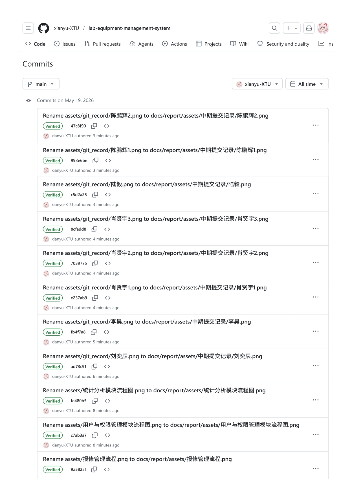

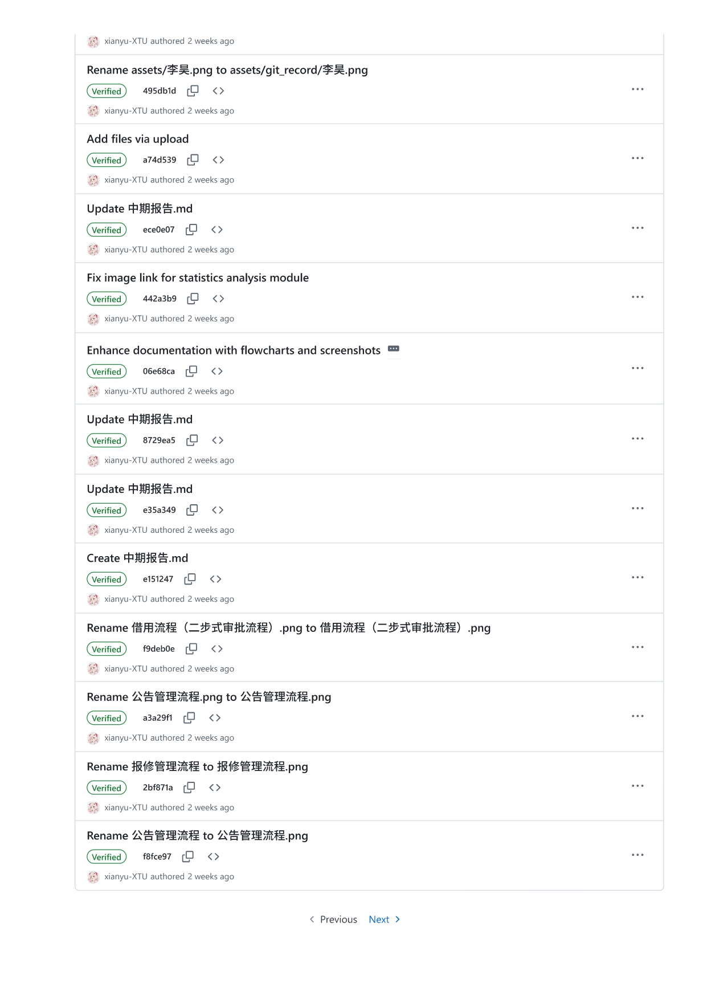
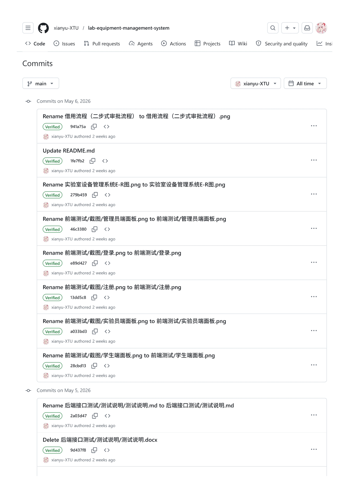

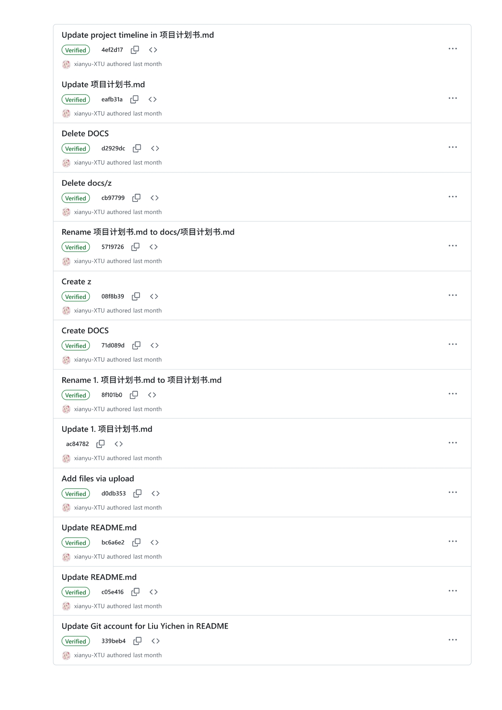
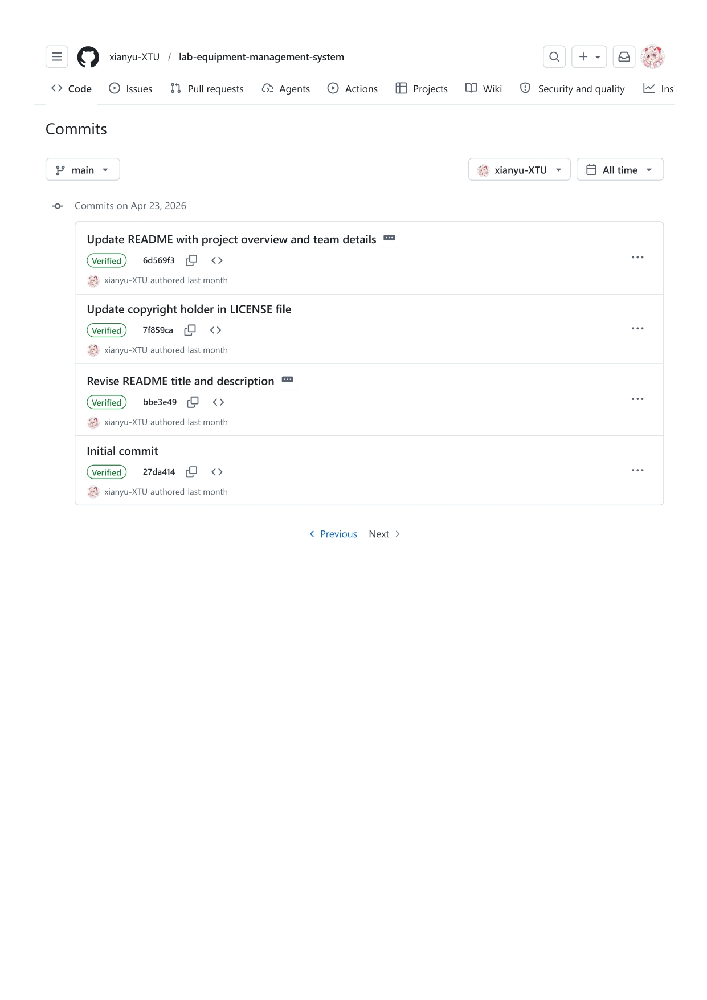
#### （2）刘奕辰提交记录

主要工作内容：完成后端框架设计、登录注册、权限拦截和接口整合。

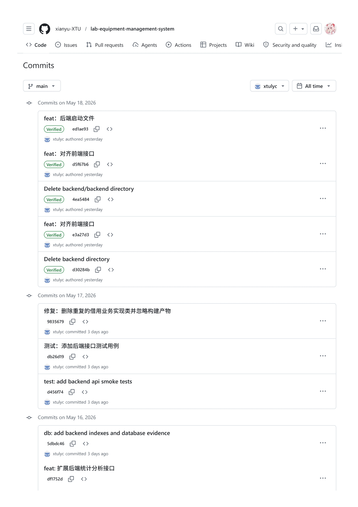
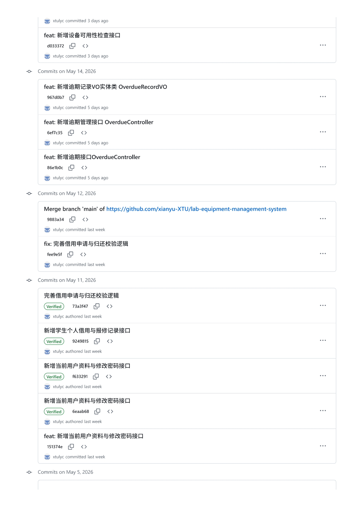


#### （3）陆毅提交记录

主要工作内容：完成前端页面设计、页面联调与功能测试。

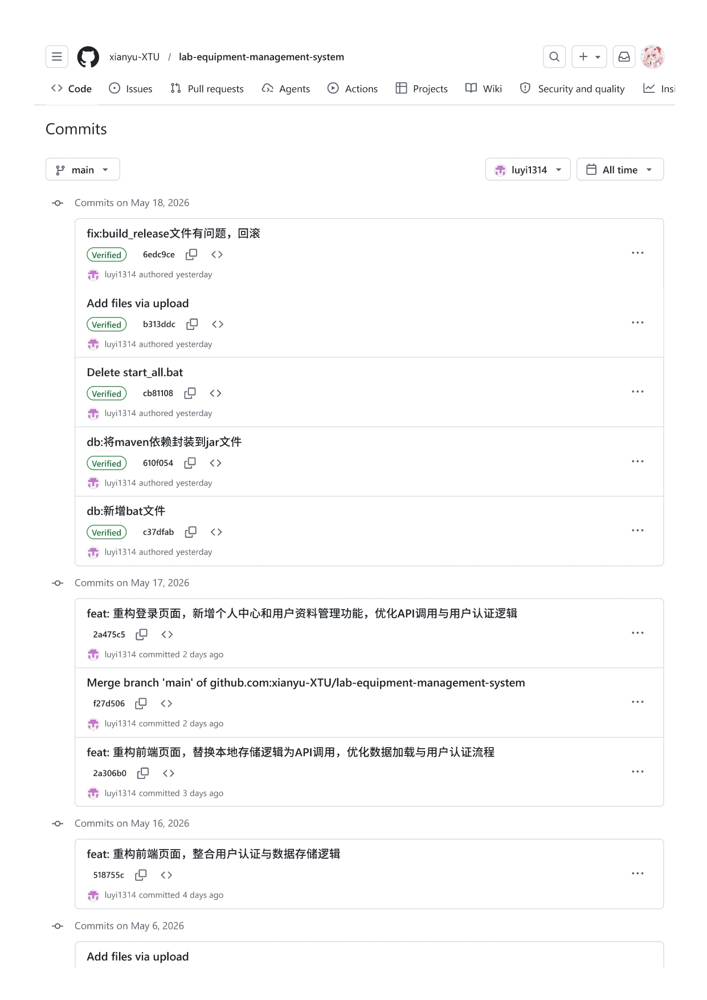


#### （4）陈鹏辉提交记录

主要工作内容：绘制流程图，补充测试数据，完成报修、公告和统计相关功能。

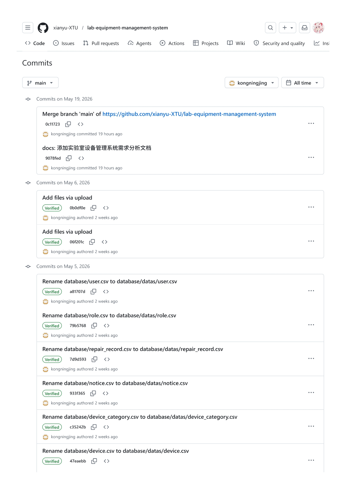
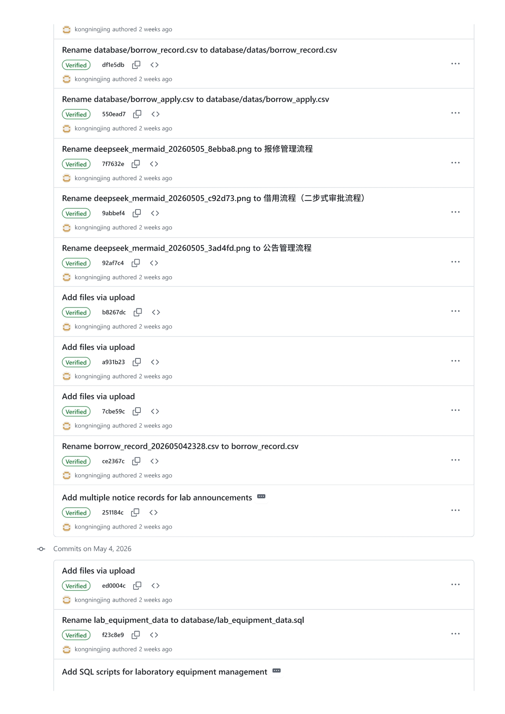


#### （5）李昊提交记录

主要工作内容：进行后端接口测试，结项总测试，整理测试用例和结项材料。

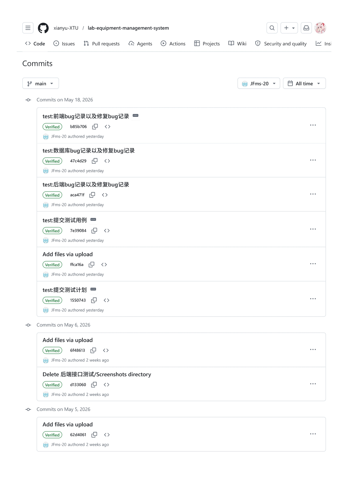

---

## 八、附录

### 1. 参考资料

- Spring Boot 官方文档
- MyBatis-Plus 官方文档
- MySQL 8.0 官方文档
- Bootstrap 官方文档
- Maven 官方文档

### 2. 源代码仓库链接

```text
https://github.com/xianyu-XTU/lab-equipment-management-system
```

### 3. 项目文件组织建议

```text
lab-equipment-management-system/
├── backend/                 后端 Spring Boot 项目
├── frontend/                前端页面文件
├── database/                数据库 SQL 文件
├── docs/                    项目文档
├── 前端测试/                前端页面测试截图
├── 后端接口测试/            后端接口测试材料
└── 系统测试                结项系统总测试
```
